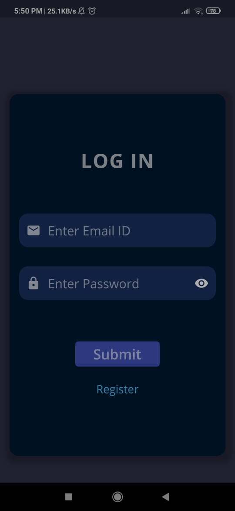
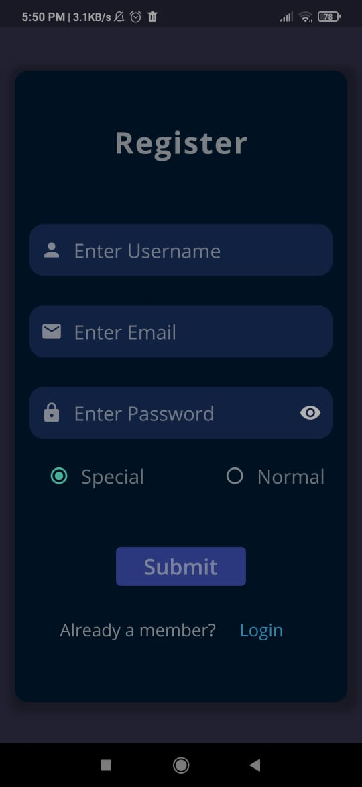
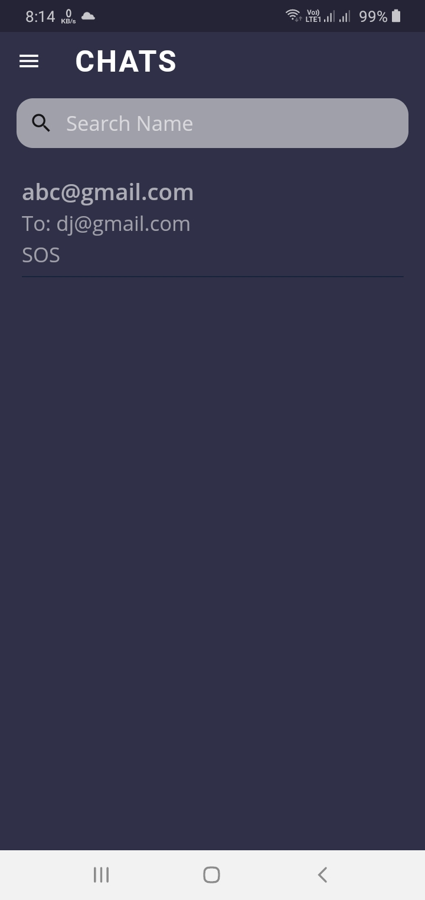
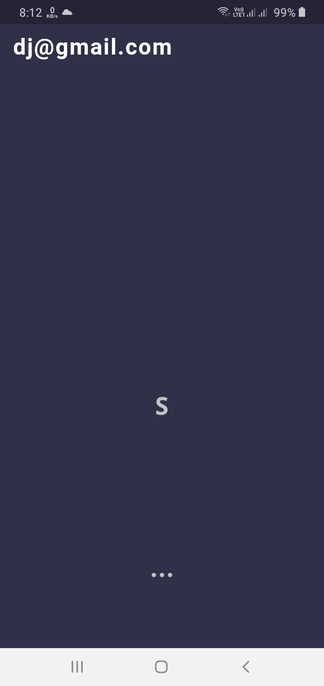
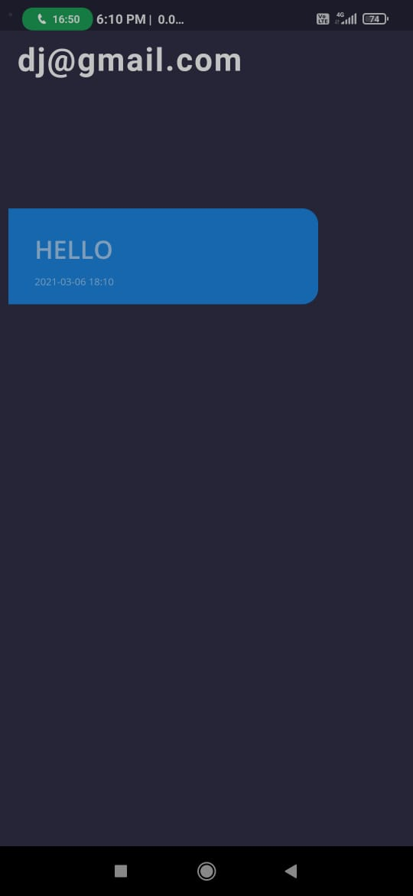
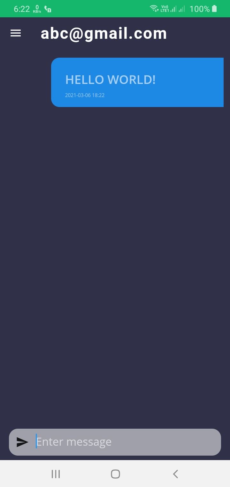

# Morse-English Chat

A new Flutter application using Firebase as a database.

The visually impaired and those with hearing loss often face a lot of inconveniences while performing the most basic tasks that we otherwise wouldn't even think about. With the gift of portability and the availability of assisting technologies, mobiles are a godsend for those with disabilities and can help them perform tasks with ease. Mobile apps for the deaf and blind available today are helping them be independent and gain confidence in their daily lives.

Morse Chat is a similar assisting application which contribute to elimination of the main communication-related obstacles that hamper the daily lives of millions of deaf and hard of hearing people around the world.It enables people who cannot see and talk to have a two-way communication with their loved ones using their mobile phones.The app has two different user interfaces, one interface for the deaf-blind, which uses vibrations, taps and gestures, while the other UI is  a standard chat interface for normal user.
A deaf-blind person uses a combination of dots and dashes (Morse Code) to send their messages.
Text messages sent are received as vibrations in Morse code that the deaf-blind can interpret.
The standard interface allows users to type to send messages to the deaf-blind.

The app uses Google Firestore,  a secure cloud-hosted NoSQL database for storing and syncing data.

# App UI
          
          
          
